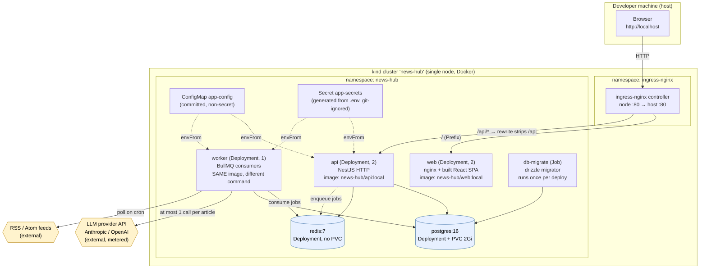

# Architecture — deployment view

How the News Intelligence Hub is packaged, deployed and operated on Kubernetes,
and why the deployment is shaped the way it is.

This document covers the **runtime and deployment** architecture. The
**application** decisions (what the LLM is allowed to do, entity dedup, cost
control, multi-tenancy) are documented as ADR-1 … ADR-6 in the
[README](../README.md#architectural-decisions) and are not repeated here — the
ADRs below continue that numbering from ADR-7 and reference the earlier ones
where a deployment choice follows from an application choice.

---

## 1. System diagram

### Request paths

| Path | Route | Notes |
|---|---|---|
| `http://localhost/` | Ingress `web` → `web` Service → nginx | SPA shell |
| `http://localhost/graph` | same | Client-side route; nginx `try_files` falls back to `index.html` |
| `http://localhost/api/health` | Ingress `api` (rewrite) → `api` Service → Nest `/health` | The `/api` prefix is stripped by the Ingress |
| `http://localhost/assets/*` | Ingress `web` | Fingerprinted, `Cache-Control: immutable` |

There is **no** ingress path to `/metrics`, to the worker, or to Bull Board.
Those are reachable only inside the cluster.

---

## 2. Component inventory

| Component | Kind | Replicas | State | Why |
|---|---|---|---|---|
| `web` | Deployment + Service | 2 | none | Static bundle; trivially replicable |
| `api` | Deployment + Service | 2 | none | JWT bearer auth, no server-side session ⇒ horizontally scalable |
| `worker` | Deployment | 1 | none | Pulls from Redis; no Service because nothing calls it |
| `db-migrate` | Job | — | — | Runs to completion before the app rolls out |
| `postgres` | Deployment + Service + PVC | 1 | **durable** | System of record |
| `redis` | Deployment + Service | 1 | ephemeral | Broker only; contents are reconstructible |

Configuration is split in two: `k8s/10-config.yaml` (ConfigMap, committed, no
secrets) and a generated `k8s/secret.yaml` (git-ignored). The generator
(`scripts/k8s-secret.sh`) copies **only** the five sensitive keys out of `.env`
and refuses to run if the output file has somehow become tracked by git.

---

## 3. Architecture decisions (deployment)

Continuing the numbering from the README's ADR-1 … ADR-6.

### ADR-7: The API and the worker are separate Deployments sharing one image

**Context.** The system does two very different kinds of work. Serving the SPA's
requests is latency-sensitive, cheap and bursty-by-user. Processing an article is
latency-*insensitive*, expensive (an LLM call), and bursty-by-feed — a single
poll cycle can enqueue hundreds of articles at once.

**Decision.** Run them as two Deployments (`api`, `worker`) built from the **same
image**, differing only in the container `command`
(`dist/main.js` vs `dist/worker.js`). This mirrors the existing docker-compose
topology, so local and cluster runs stay comparable.

**Alternatives.**
- *One process doing both.* An LLM burst would then compete with user requests
  for the same event loop, and scaling for the burst would over-scale the API.
- *Two separate images.* Doubles build time and image storage, and introduces the
  possibility of the two drifting to different commits of the same code.

**Trade-offs.** One image means the API pod carries the worker code it never runs
(a few hundred KB — irrelevant). In exchange, `api` and `worker` are guaranteed
to be the same build, and only one image needs building and `kind load`-ing. The
two can now be scaled on independent signals: API on request latency, worker on
`bullmq_queue_jobs{state="waiting"}`.

### ADR-8: Postgres runs in-cluster here, and would not in production

**Context.** The app needs durable Postgres. The whole point of this exercise is
a $0, fully local deployment.

**Decision.** Run `postgres:16-alpine` in-cluster as a Deployment plus a 2Gi
PersistentVolumeClaim, backed by kind's local-path provisioner. Redis gets **no**
PVC at all.

The Redis asymmetry is deliberate and is the more interesting half: Redis holds
only in-flight BullMQ job state, and every job is reconstructible from Postgres
(the feed list and the articles are the durable truth). Losing Redis costs one
polling cycle, not data — so a volume there would add operational weight while
protecting nothing.

**Alternatives.**
- *StatefulSet for Postgres.* The correct choice for a replicated cluster, but
  with exactly one replica it buys only a stable pod name — no ordered rollout to
  order, no per-replica volume to track. `strategy: Recreate` already prevents
  the real hazard (two pods briefly sharing one ReadWriteOnce volume).
- *A managed database* (RDS / Cloud SQL / Neon). What production should use.

**Trade-offs.** In-cluster Postgres has no automated backup, no point-in-time
recovery, no failover, and its durability is only as good as the node's disk — if
the kind node is deleted, the data is gone. That is an acceptable trade for a
local demo and an unacceptable one for real users. **In production I would move
Postgres out of the cluster to a managed service** and keep only the stateless
workloads in Kubernetes: the operational cost of running a database correctly
(backup verification, upgrades, failover drills) is real work that a managed
provider does better and cheaper than I would. Nothing in the app would change —
only `POSTGRES_HOST` and the credentials in the Secret.

### ADR-9: Readiness is dependency-aware; liveness is deliberately not

**Context.** The app already exposes `GET /health`, which actively `SELECT 1`s
Postgres and `PING`s Redis and returns 503 if either fails. The obvious move is
to point both Kubernetes probes at it. That obvious move is a trap.

**Decision.**
- **Readiness** → `httpGet /health`. A pod that cannot reach its dependencies
  should be removed from the Service's endpoints and receive no traffic.
- **Liveness** → `tcpSocket` on the HTTP port. It answers only "is this process
  wedged?".
- **Startup** → `tcpSocket` with a generous `failureThreshold`, so a slow cold
  start is not mistaken for a hang.

**Alternatives.** Point liveness at `/health` too.

**Trade-offs.** Restarting the API cannot fix a database outage. If liveness were
dependency-aware, a brief Postgres blip would fail liveness on *every* API pod
simultaneously, and Kubernetes would respond by killing all of them into
`CrashLoopBackOff` — converting a recoverable dependency incident into a total,
self-inflicted outage that then takes exponential backoff to climb out of. The
split costs a little fidelity (a wedged-but-listening process is caught more
slowly) to remove that failure mode entirely.

The worker gets real probes too: it serves `/healthz` on its metrics port
(ADR-11), so its liveness check asserts the process is *responsive*, not merely
that it has not exited.

### ADR-10: Same-origin routing — the Ingress mounts the API under `/api`

**Context.** The SPA's API base URL is baked into the bundle at build time
(`VITE_API_URL`, read once in `packages/frontend/src/lib/api.ts`). The backend's
own routes are at the root: `/health`, `/feeds`, `/articles` — there is no global
`/api` prefix in the Nest app.

**Decision.** Build the image with `VITE_API_URL=/api` (relative), and route
`/api/*` at the Ingress to the `api` Service with
`nginx.ingress.kubernetes.io/rewrite-target: /$2`, which strips the prefix so
Nest still sees `/health`. The browser then only ever talks to one origin.

This needs **two Ingress resources**, not one, and that is not stylistic: the
`rewrite-target` annotation applies to every path in the resource it is set on.
Putting the SPA's `/` rule in the same object would rewrite the SPA's paths
against a capture group that does not exist there and serve blank pages.

**Alternatives.**
- *Absolute URL to a separate API host.* Requires CORS (the app currently calls
  `app.enableCors()` permissively), a second hostname, and a rebuild to move
  environments.
- *Add a global `/api` prefix in Nest.* Cleaner in some ways, but it would change
  the app's public contract and break the existing docker-compose setup and the
  README's documented routes.

**Trade-offs.** The rewrite is one annotation that a reader must understand, and
the baked-in build arg means moving the API to another origin needs an image
rebuild. In exchange: no CORS in the deployed path, no hardcoded hostname, and
the SPA works identically at `localhost` or any future domain.

### ADR-11: Observability is per-process, because the money is spent in the worker

**Context.** The repo had no Prometheus endpoint. It *does* have a `/telemetry`
controller, but that is per-user LLM cost accounting behind a JWT guard — a
product feature, not an operations one. Crucially, `LlmModule` is imported only
by `WorkerModule`: **all LLM calls happen in the worker**, which is an
`ApplicationContext` with no HTTP server at all.

**Decision.** A shared `MetricsModule` owns one Prometheus registry, exposed
differently per process:
- **API** → a Nest controller at `GET /metrics`, plus an interceptor recording
  `http_request_duration_seconds` labelled by *matched route* (`/articles/:id`),
  never raw URL, so cardinality stays bounded by endpoint count rather than
  growing with traffic.
- **Worker** → a bare `node:http` listener on `METRICS_PORT` (9091) serving
  `/metrics` and `/healthz`, rather than promoting the worker to a full HTTP app
  and inheriting routing, CORS and middleware it has no use for.

`llm_calls_total{provider,outcome}` is incremented from `ResilientLlmService` via
an optional plain callback, not an injected service — which keeps that class
framework-free and its unit tests pure. Because the observer fires per *attempt*,
a failover records both the failure and the subsequent success, so cost is
attributed to the provider that actually served it (see ADR-4).

Logging switches to one JSON object per line when `NODE_ENV=production`. Nothing
reads a pod's stdout with human eyes: it is scraped by a log agent, where ANSI
colour codes corrupt the parse and columns must be regex-matched, while a JSON
line is indexed as-is and `context`/`level`/`trace` become queryable fields.
Development keeps the pretty logger, because there the human *is* the consumer.

**Alternatives.** Ship OpenTelemetry now; or add a Prometheus sidecar per pod.

**Trade-offs.** These are metrics, not traces — they answer "how many, how slow,
how deep is the queue" but not "where did this one article spend its 9 seconds".
That is the right first increment: it is dependency-light, and both pods already
carry `prometheus.io/scrape` annotations, so **adding Prometheus + Grafana later
requires no change to any Deployment**. See §6 for how tracing would slot in.

### ADR-12: Migrations are a Job gating the rollout, not a step in API startup

**Context.** Schema must be current before the API serves traffic. The repo's
compose file already models this as a one-shot `migrate` service, and the
migrator is a standalone entrypoint (`dist/database/migrate.js`) rather than
something wired into `main.ts`.

**Decision.** A `batch/v1` Job that the deploy script runs — and waits on — before
applying the app workloads. An init container blocks on `pg_isready` first, so
the ordinary cold-start case is a clean wait rather than a crash-retry loop, and
`backoffLimit: 6` covers genuinely transient failures (Drizzle's migrator is
idempotent, so retrying is safe).

**Alternatives.** Migrate on API boot.

**Trade-offs.** The Job is an extra object, and because a completed Job's pod
template is immutable the deploy script must delete it before re-applying. In
exchange, `api.replicas: 2` is safe: with migrate-on-boot, two replicas race to
apply the same DDL on every rollout. The Job also produces a real exit code to
gate on — a failed migration stops the deploy with the migrator's own logs
instead of leaving pods to crash-loop against a half-migrated schema.

---

## 4. Cost and scale

### What the hosting costs

**$0.** Everything above runs on one kind node inside Docker on the developer's
machine: no cloud account, no load balancer, no managed database, no egress. The
only paid resource the system touches is the **LLM provider API**, which is
metered per call and is entirely separate from hosting.

Rough footprint from the manifests' `requests` (what the scheduler reserves):

| Workload | CPU req | Mem req | Replicas | CPU total | Mem total |
|---|---|---|---|---|---|
| api | 100m | 192Mi | 2 | 200m | 384Mi |
| web | 25m | 32Mi | 2 | 50m | 64Mi |
| worker | 100m | 192Mi | 1 | 100m | 192Mi |
| postgres | 100m | 256Mi | 1 | 100m | 256Mi |
| redis | 50m | 64Mi | 1 | 50m | 64Mi |
| **Total** | | | | **~0.5 vCPU** | **~0.94 GiB** |

That fits comfortably in a 2 vCPU / 4 GiB Docker Desktop VM. Memory `limits` are
set (so a leak is contained) but CPU limits deliberately are not: CPU is
compressible, and a limit would throttle burst article processing for no benefit
on a single-tenant local node.

### What the LLM costs, and why the architecture caps it

Hosting is flat; LLM cost is the variable that scales with feeds. Three
mechanisms in the existing design bound it, and they compose multiplicatively:

1. **The deterministic pre-filter** (`processing/pre-filter.ts`) drops empty,
   too-short, and low-information articles — including a unique/total word-ratio
   check below `0.25` that catches templated SEO filler — before any call. Free.
2. **The content-hash cache** (`llm_cache`, keyed by SHA-256 over normalized
   title + body, shared across users) means identical content is analyzed once
   however many feeds or users carry it. Free on a hit.
3. **At most one provider call per article** (ADR-1), with `LLM_MAX_TOKENS`
   capping tokens per call.

So the steady-state cost is not `articles × price`, it is
`(distinct, non-junk articles) × (1 call) × (≤ LLM_MAX_TOKENS)`. Duplicate
syndicated coverage — which is most of what overlapping news feeds produce —
costs nothing after the first copy. `LLM_ENTITY_MATCHING` is off by default
precisely to preserve the one-call-per-article guarantee (ADR-2).

Actual spend is observable, not guessed: every real call is recorded in
`llm_usage` and surfaced per-operation by `GET /telemetry/llm`, with
`llm_calls_total{provider,outcome}` on the operational side.

### Scaling path, in the order the bottlenecks actually arrive

| Load change | Response | Why it works |
|---|---|---|
| More concurrent users | `kubectl scale deploy/api --replicas=N` | Stateless, JWT bearer auth, no sticky sessions |
| More feeds / article backlog | Scale `worker`, and/or raise `WORKER_CONCURRENCY` | Competing consumers on one Redis queue; BullMQ distributes |
| LLM rate limits become the ceiling | *Stop* scaling workers; lower concurrency | Past the provider's limit, more workers produce 429s and retry storms, not throughput |
| Postgres CPU / connection saturation | Move to managed Postgres (ADR-8); add PgBouncer | Each API and worker pod holds its own `pg` pool; pods × pool size is the real connection count |
| Redis is the bottleneck | Managed Redis; separate queues onto separate instances | Rare — job payloads are ids, not documents |

The honest ordering matters: **the LLM provider's rate limit is the first hard
ceiling**, well before CPU or Postgres. Beyond it the correct move is queue
patience (jobs wait in Redis, which is exactly what a queue is for), not more
replicas. Autoscaling the worker on `bullmq_queue_jobs{state="waiting"}` is the
natural next step, and the metric is already exported.

---

## 5. Failure modes

Each row is a real failure this design anticipates, what it looks like, and what
actually happens.

| # | Failure | Observed as | Behaviour and why |
|---|---|---|---|
| 1 | **LLM provider errors / rate-limits** | `llm_calls_total{outcome="failure"}` climbs | The adapter enforces a per-call `AbortController` timeout and validates output against a zod schema (invalid JSON never reaches the DB). `ResilientLlmService` fails over to the other provider *if it has a key*; otherwise BullMQ retries with exponential backoff (3 attempts). Exhausted retries mark the article `failed` for later pickup. **The API is unaffected throughout** — it does not call the LLM (ADR-7). |
| 2 | **Postgres pod restarts** | `api` pods go NotReady; `/health` returns 503 | Readiness removes them from the Service so no request hits a dead pool; liveness is TCP-only, so they are *not* killed (ADR-9) and recover as soon as Postgres is back. Data survives via the PVC. In-flight jobs retry. |
| 3 | **Redis is lost entirely** | Queue depth resets to 0 | Job state is gone, but no *data* is lost: feeds and articles live in Postgres. The next `FEED_POLL_CRON` tick re-enqueues. This is why Redis has no PVC (ADR-8). |
| 4 | **A single feed is malformed or unreachable** | One feed's status shows the error | `FEED_FETCH_TIMEOUT_MS` bounds the fetch; the error is recorded on that feed's row and other feeds keep polling. One bad publisher cannot stall ingestion. |
| 5 | **Worker pod evicted mid-article** | Pod restarts | `terminationGracePeriodSeconds: 60` lets an in-flight LLM call finish rather than being killed and retried — a retry would pay for the same article twice. If it is killed anyway, BullMQ redelivers and the content-hash cache makes the reprocess free. |
| 6 | **Migration fails** | Deploy stops at step 5/6 | The Job's non-zero exit stops the script *before* the new app pods roll out, and the migrator's logs are printed. The previous version keeps serving. |
| 7 | **A bad image is deployed** | New ReplicaSet never goes Ready | Readiness gating means the rolling update stalls with old pods still serving; `kubectl rollout undo deployment/api -n news-hub` reverts. `web` and `api` at 2 replicas make this a non-event. |
| 8 | **Duplicate article from two feeds** | Not a failure — the expected case | Deterministic dedup by normalized URL and by content hash, before any LLM call. |
| 9 | **Secret missing or malformed** | Pods `CreateContainerConfigError`, or exit at boot | Zod validation in `config/env.validation.ts` fails loudly at startup with every problem listed, rather than throwing obscurely deep in a request later. |

### Known limitations of *this* deployment

Stated plainly, because a portfolio piece that overclaims is worse than one that
does not:

- **Single node, single replica of each datastore.** No HA. A node failure is a
  total outage; Postgres has no backup or PITR (ADR-8).
- **No TLS.** Plain HTTP on `localhost`. Production needs cert-manager + a real
  hostname.
- **No NetworkPolicy.** Any pod in the namespace can reach Postgres and Redis
  directly. `/metrics` is unauthenticated and safe only because nothing routes
  to it from outside; exposing it would need an auth proxy or a NetworkPolicy.
- **Secrets are base64, not encrypted.** Kubernetes Secrets are not encrypted at
  rest by default. Production wants SOPS/sealed-secrets or an external secrets
  operator backed by a KMS.
- **`kind load docker-image` is not a registry.** Fine locally; a real cluster
  needs a registry and immutable, digest-pinned tags instead of `:local`.

---

## 6. Where OpenTelemetry, Prometheus and Grafana would slot in

Deliberately **not installed** — all three are free and open-source, but running
them locally would triple this cluster's resource footprint to observe a system
that currently has one worker. The groundwork is done so that adding them is
configuration, not refactoring.

**Prometheus + Grafana (the next step, ~30 minutes).** Both `api` and `worker`
pods already carry `prometheus.io/scrape`, `/port` and `/path` annotations, so a
`kube-prometheus-stack` Helm install would discover them with **no change to any
manifest in `k8s/`**. The first four panels worth building:

1. `bullmq_queue_jobs{state="waiting"}` per queue — the backlog, and the signal
   a worker HPA would scale on.
2. `rate(llm_calls_total[5m])` by `provider` and `outcome` — spend rate and
   failover activity in one chart.
3. `histogram_quantile(0.95, rate(http_request_duration_seconds_bucket[5m]))` by
   route — API latency.
4. `bullmq_queue_jobs{state="failed"}` — the alert that matters most, since a
   climbing failed count means articles are silently not being processed.

**OpenTelemetry (the step after).** Metrics answer *how many* and *how slow*;
they cannot answer *where one article spent nine seconds*. Tracing can, and this
app has exactly the shape that makes it worthwhile: a request crosses an HTTP
boundary, a Redis queue, a process boundary, and an external API. The wiring:

- Add `@opentelemetry/sdk-node` with auto-instrumentation (HTTP, `pg`, `ioredis`)
  initialised before the Nest bootstrap in `main.ts` and `worker.ts` — the same
  two entrypoints that already call `createLogger()`.
- **Propagate context across the queue**, which is the part auto-instrumentation
  does not do for you: inject the trace context into the BullMQ job payload when
  enqueuing and extract it in the worker, so "user clicks poll" and "article is
  analyzed 40 seconds later in another pod" are one trace rather than two.
- Wrap the LLM adapter call in a span with `provider`, `model` and token counts
  as attributes — the same data already written to `llm_usage`, so cost analysis
  and latency analysis share one identifier.
- Export via OTLP to a collector; keep Prometheus as the metrics backend and add
  Jaeger or Tempo for traces.
- Add the trace id to the JSON log line, making logs, metrics and traces
  mutually navigable. `JsonLogger` is the single place that change is made.

**What would stay off.** Managed/paid APM (Datadog, New Relic) — the OSS stack
covers everything above at no licence cost, and the instrumentation is
vendor-neutral OTLP, so switching later is an exporter change.
